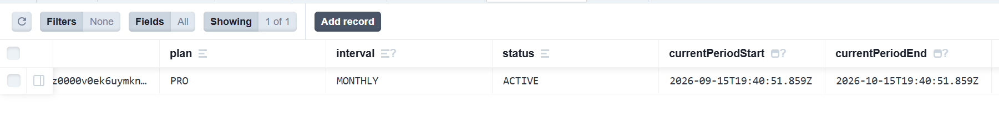
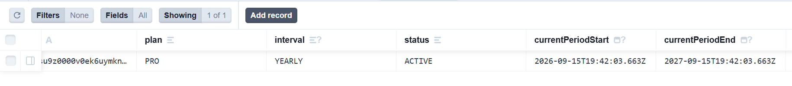
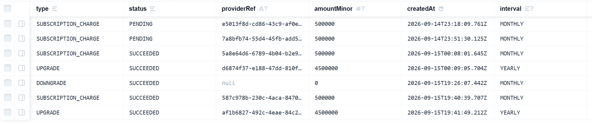

# Payment and Subscription Slice — DOCUMENTATION.md

## Section 1: What This Is

This is a complete payment and subscription slice built with Next.js, TypeScript, 
Prisma, PostgreSQL, and Flutterwave. It handles the full subscription lifecycle 
for a web application: plan selection, payment initiation, webhook-based 
fulfilment, mid-cycle upgrades with proration, end-of-period downgrades, and 
cancellation with retained access. The product being sold is called Qilo. It has 
three plans — Free, Pro Monthly at 5,000 Naira per month, and Pro Yearly at 
50,000 Naira per year. The payment experience lives inside a signed-in dashboard 
at `/dashboard` which conditionally renders the plans view, billing view, and 
return view based on a URL query parameter.

Authentication is reused from Assessment 1. The original repository is here: 
https://github.com/chimaworlu/Auth-Slice. Reuse is declared and not hidden. 
The thing being sold is a plan flag on a user record and nothing more. There are 
no product features behind the paywall. The dashboard shows only the plan 
management screens.

This slice does not include a landing page, a marketing page, a pricing page, 
any product features behind the paywall, or any payment method other than 
Flutterwave. These were deliberately left out because the assessment scope is 
the subscription system only.

## Section 2: How To Run It

### Prerequisites
- Node.js 18 or higher
- Docker (for PostgreSQL and Redis)
- A Flutterwave account in test mode with API keys
- A Gmail account with 2-Step Verification enabled and an App Password generated

### Steps

1. Clone the repository and navigate into it

2. Run `npm install` to install all dependencies

3. Start your Docker containers for PostgreSQL and Redis

4. Copy the example environment file with `cp .env.example .env` and fill in these values:

   | Variable | Description | Where to get it |
   |---|---|---|
   | `DATABASE_URL` | PostgreSQL connection string | From your Docker PostgreSQL container |
   | `NEXTAUTH_SECRET` | Random secret for encrypting sessions | Run `openssl rand -base64 32` |
   | `NEXTAUTH_URL` | Base URL of the app | Set to `http://localhost:3000` |
   | `GMAIL_USER` | Gmail address for sending emails | Your Gmail address |
   | `GMAIL_PASS` | Gmail App Password | myaccount.google.com > Security > App Passwords |
   | `REDIS_URL` | Redis connection string | From your Docker Redis container e.g. `redis://localhost:6380` |
   | `FLUTTERWAVE_PUBLIC_KEY` | Flutterwave public key | Flutterwave dashboard > API Keys (test mode) |
   | `FLUTTERWAVE_SECRET_KEY` | Flutterwave secret key | Flutterwave dashboard > API Keys (test mode) |
   | `FLUTTERWAVE_WEBHOOK_SECRET` | Webhook verification secret | Any random string. Must match what you set in Flutterwave dashboard > Webhooks |
   | `PRO_MONTHLY_PRICE_MINOR` | Monthly price in kobo | Set to 500000 (5,000 Naira) |
   | `PRO_YEARLY_PRICE_MINOR` | Yearly price in kobo | Set to 5000000 (50,000 Naira) |
   | `PRO_MONTHLY_PLAN_NAME` | Monthly plan display name | Set to "Qilo Pro Monthly" |
   | `PRO_YEARLY_PLAN_NAME` | Yearly plan display name | Set to "Qilo Pro Yearly" |

5. Run the database migrations with `npx prisma migrate deploy`

6. Start the development server with `npm run dev`

7. Open your browser and go to `http://localhost:3000`

8. Sign up for an account and verify your email to access the dashboard

### Important notes
- All prices are stored in kobo. Never change these values to Naira.
- `FLUTTERWAVE_WEBHOOK_SECRET` is a string you create yourself. It is not 
  generated by Flutterwave. Set the same value in your Flutterwave dashboard 
  under Settings > Webhooks > Secret Hash.
- In development mode a webhook simulation route is available at 
  `/api/payment/webhook/simulate`. This route does not exist in production.
- For test payments use Flutterwave test card: `5531 8866 5214 2950`, 
  PIN `3310`, OTP `123456`.
- Never commit your `.env` file. Only `.env.example` is committed.

## Section 3: The Flow, Step By Step

This section walks through every user journey from first action to last. For 
each step it states what the user does, what the frontend sends, and what the 
server does with it.

---

### Subscribing to a plan

The user signs in and lands on `/dashboard?view=plans`. They see three plan 
cards: Free, Pro Monthly, and Pro Yearly.

**Step 1 — User clicks Subscribe Monthly or Subscribe Yearly**
- What the user does: clicks the subscribe button on their chosen plan card
- What the frontend does: shows a loading state on that button and calls 
  `POST /api/payment/checkout` with `{ interval: "MONTHLY" }` or 
  `{ interval: "YEARLY" }`
- What the server does: validates the body, checks the rate limit, verifies 
  the user is not already on that plan, generates an idempotency key, writes 
  a Transaction record with status PENDING to the database, calls Flutterwave 
  to create a hosted payment link, and returns the link
- File: `app/_components/PlansView.tsx` and `app/api/payment/checkout/route.ts`

**Step 2 — User completes payment on Flutterwave**
- What the user does: fills in their card details on the Flutterwave hosted 
  checkout page and submits
- What the frontend sends: nothing. The user is on Flutterwave's page at this point.
- What Flutterwave does: processes the payment and redirects the user back to 
  `/dashboard?view=return&status=successful&tx_ref=[ref]&transaction_id=[id]`

**Step 3 — User lands on the return view**
- What the user does: lands on the return view automatically after payment
- What the frontend does: reads the status and tx_ref from the URL. In 
  development mode it automatically calls 
  `POST /api/payment/webhook/simulate` with the transaction id and tx_ref 
  to simulate the Flutterwave webhook. In production the real webhook fires 
  from Flutterwave's servers.
- What the server does (webhook handler): verifies the webhook signature, 
  checks idempotency, calls Flutterwave's Verify Transaction API to confirm 
  the payment is genuine, checks the amount matches, then in a single Prisma 
  transaction updates the Transaction record to SUCCEEDED and upserts the 
  Subscription record with plan PRO, correct interval, status ACTIVE, and 
  period dates.
- File: `app/_components/ReturnView.tsx` and 
  `app/api/payment/webhook/route.ts`

**Step 4 — User checks their billing view**
- What the user does: navigates to `/dashboard?view=billing`
- What the server does: fetches the subscription from the database and passes 
  it to the billing view as a prop
- What the user sees: current plan, status ACTIVE, renewal date, and a 
  cancel button
- File: `app/_components/BillingView.tsx` and `app/dashboard/page.tsx`

---

### Upgrading from monthly to yearly

**Step 1 — User clicks Upgrade to Yearly**
- What the user does: clicks the upgrade button on the yearly plan card
- What the frontend does: calls `POST /api/payment/upgrade` with 
  `{ targetInterval: "YEARLY" }`
- What the server does: calculates the prorated amount, writes a PENDING 
  Transaction record, calls Flutterwave to create a payment link, and returns 
  the link along with the proration details
- File: `app/_components/PlansView.tsx` and `app/api/payment/upgrade/route.ts`

**Step 2 — Frontend shows proration summary**
- What the user sees: "You will be charged ₦[amount] today. ₦[credit] credit 
  applied for [days] remaining days on your monthly plan. Proceed?"
- What the user does: clicks Confirm to proceed to Flutterwave or Cancel to 
  dismiss

**Step 3 — Payment and webhook**
- Same as the subscription flow. The webhook handler detects the UPGRADE 
  transaction type and switches the subscription to YEARLY with a fresh 
  365-day period.

---

### Downgrading from yearly to monthly

**Step 1 — User clicks Downgrade to Monthly**
- What the user does: clicks the downgrade button on the monthly plan card
- What the frontend does: shows a confirmation step. No API call yet.
- What the user does: clicks Confirm
- What the frontend sends: `POST /api/payment/downgrade` with 
  `{ targetInterval: "MONTHLY" }`
- What the server does: writes a DOWNGRADE Transaction record with 
  amountMinor 0, sets cancelAtPeriodEnd to true and pendingInterval to 
  MONTHLY on the Subscription. No charge is made. The change applies at 
  period end.
- File: `app/_components/PlansView.tsx` and 
  `app/api/payment/downgrade/route.ts`

---

### Cancelling a subscription

**Step 1 — User clicks Cancel on the billing view**
- What the user does: clicks the Cancel button on `/dashboard?view=billing`
- What the frontend does: shows a confirmation step with the exact end date
- What the user does: clicks Confirm Cancel
- What the frontend sends: `POST /api/payment/cancel`
- What the server does: in a single Prisma transaction sets cancelAtPeriodEnd 
  to true on the Subscription and writes a CANCELLATION Transaction record 
  with amountMinor 0. The subscription status stays ACTIVE. The user keeps 
  access until currentPeriodEnd.
- File: `app/_components/BillingView.tsx` and 
  `app/api/payment/cancel/route.ts`

---

### Evidence — Payment log and subscription records

Subscription record before and after upgrade:



Payment log showing each event as its own row:


Duplicate webhook showing idempotency:


Cancelled subscription showing access retained:


## Section 4: The Data Model

This slice uses six tables. The four auth tables are reused from Assessment 1. 
Two new tables were added for payment: Subscription and Transaction.

### Subscription
Stores the user's current plan and billing state. One row per user.

| Column | Type | Decision |
|---|---|---|
| `id` | String (cuid) | Unique identifier |
| `userId` | String (unique, foreign key) | One subscription per user enforced at the database level. Cascade delete. |
| `plan` | PlanType enum | FREE or PRO. Updated only by the webhook handler after a confirmed payment. |
| `interval` | BillingInterval enum (nullable) | MONTHLY or YEARLY. Null means free plan. |
| `status` | SubscriptionStatus enum | ACTIVE, CANCELED, or PAST_DUE. |
| `currentPeriodStart` | DateTime (nullable) | When the current billing period started. |
| `currentPeriodEnd` | DateTime (nullable) | When the current billing period ends. Access is retained until this date even after cancellation. |
| `cancelAtPeriodEnd` | Boolean | Defaults to false. Set to true when the user cancels or requests a downgrade. |
| `pendingInterval` | BillingInterval enum (nullable) | Stores a pending interval change that applies at period end. Used for downgrades. |
| `providerRef` | String (nullable) | Flutterwave transaction reference for the most recent payment. |
| `createdAt` | DateTime | Audit field. |
| `updatedAt` | DateTime | Updated automatically on every write. |

The unique constraint on userId makes it structurally impossible to create two 
subscriptions for the same user. Even a race condition where two checkout 
requests arrive simultaneously will result in only one subscription record.

### Transaction (Payment Log)
Records every payment event as a separate, append-only row. Never updated 
except to change status from PENDING to SUCCEEDED or FAILED.

| Column | Type | Decision |
|---|---|---|
| `id` | String (cuid) | Unique identifier |
| `userId` | String (foreign key) | Links the transaction to the user. Cascade delete. |
| `type` | TransactionType enum | SUBSCRIPTION_CHARGE, UPGRADE, DOWNGRADE, CANCELLATION, or REFUND. |
| `status` | TransactionStatus enum | PENDING, SUCCEEDED, or FAILED. |
| `amountMinor` | Int (nullable) | Amount in kobo. Always a whole integer. Never a float or decimal. Zero for downgrades and cancellations. |
| `currency` | String | Defaults to NGN. |
| `interval` | BillingInterval enum (nullable) | The billing interval this transaction relates to. |
| `providerRef` | String (nullable) | Flutterwave transaction reference. Used for idempotency — checked before processing any webhook to prevent double processing. |
| `description` | String (nullable) | Human readable description of the event including proration details for upgrades. |
| `createdAt` | DateTime | Timestamp of the event. Every row has its own timestamp. |

The Transaction table is the history of everything that happened. The 
Subscription table is the current state. In a dispute the Transaction table 
is what you show — it has a row for every event with a timestamp and a 
description.

### Database constraints that make invalid states impossible

| Constraint | What it prevents |
|---|---|
| `userId @unique` on Subscription | Two subscriptions for the same user |
| `@@index([userId])` on Subscription | Slow queries on the dashboard |
| `@@index([userId])` on Transaction | Slow queries on the billing history |
| `@@index([providerRef])` on Transaction | Slow idempotency lookups on webhook |
| `onDelete: Cascade` on both tables | Orphaned records when a user is deleted |
| `amountMinor Int` not Float | Money stored as whole numbers in kobo. A float type would allow 5000.50 kobo which is not a valid amount. |

### Evidence — Users table and subscription records


## Section 5: The Concepts

### Minor Units and Why Money is Never a Decimal

**What it is.**
Minor units means storing money as the smallest indivisible unit of a currency. 
For Nigerian Naira the smallest unit is the kobo. One Naira equals 100 kobo. 
So 5,000 Naira is stored as 500,000 kobo as a whole integer.

**Why it is needed.**
Floating point numbers cannot represent all decimal values exactly. The number 
0.1 in binary floating point is actually 0.100000000000000005551115... This 
means arithmetic on floats produces rounding errors. In money, rounding errors 
are financial errors. If you store 5000.50 Naira as a float and do arithmetic 
on it across thousands of transactions the errors accumulate. Storing money as 
a whole integer in the smallest unit means there are no decimals anywhere and 
no rounding errors are possible.

**How I implemented it.**
The `amountMinor` field on the Transaction model is typed as `Int` in the 
Prisma schema. All prices are stored in environment variables in kobo. 
`PRO_MONTHLY_PRICE_MINOR=500000` means 5,000 Naira. The only place division 
by 100 happens is at the display layer when showing the price to the user in 
Naira.

```ts
// CORRECT — stored as kobo
const amountMinor = 500000; // 5,000 Naira

// CORRECT — displayed as Naira at the edge only
const display = `₦${(amountMinor / 100).toLocaleString('en-NG')}`;
```

**What I chose against.**
I considered using a Decimal type from Prisma which supports arbitrary 
precision. This would avoid rounding errors too, but it is slower, requires 
more complex serialization, and is unnecessary. Whole integer kobo is simpler, 
faster, and standard practice in payment systems.

---

### The Payment Lifecycle: Initiation, Verification, and Fulfilment

**What it is.**
A payment goes through three distinct phases. Initiation is when the user 
requests to pay and the server creates a payment intent. Verification is when 
the server confirms with the payment provider that money actually moved. 
Fulfilment is when the server grants the benefit the user paid for.

**Why it is needed.**
Treating these as one step is the most common and most dangerous mistake in 
payment integration. If you grant the subscription when the user lands back on 
your return URL, anyone who knows that URL gets a free subscription by visiting 
it directly. The redirect from Flutterwave is not proof of payment. It is just 
a browser navigation. Only a server-to-server verification call to Flutterwave 
confirms the payment is real.

**How I implemented it.**
Initiation happens in `app/api/payment/checkout/route.ts` — the server creates 
a PENDING Transaction record and returns a Flutterwave payment link. 
Verification and fulfilment happen in `app/api/payment/webhook/route.ts` — 
after Flutterwave sends a webhook the server calls 
`flutterwave.Transaction.verify()` to confirm the payment, then grants the 
subscription only after that confirmation passes.

**What I chose against.**
I considered granting the subscription on the return URL redirect. This is 
simpler to implement but completely insecure. The webhook approach is the 
correct pattern for any production payment system.

---

### The Payment Log and What It Proves in a Dispute

**What it is.**
A payment log is an append-only table where every payment event gets its own 
row. Nothing is updated or deleted. Initiation, verification, fulfilment, and 
failure each produce a new row with a timestamp.

**Why it is needed.**
The Subscription table shows current state. If a student says "I was charged 
twice" or "I cancelled but you still charged me" the Subscription table cannot 
answer that — it only shows what is true now. The Transaction table shows every 
event that ever happened with timestamps. It is the evidence in a dispute. 
Without it you have no way to prove what happened when.

**How I implemented it.**
Every route that touches money writes to the Transaction table. The checkout 
route writes PENDING before calling Flutterwave. The webhook writes SUCCEEDED 
after verification. The cancel route writes CANCELLATION with amountMinor 0. 
The downgrade route writes DOWNGRADE with amountMinor 0. Each row has a 
`createdAt` timestamp and a `description` field explaining what happened.

**What I chose against.**
I considered updating a single Transaction row rather than creating new ones. 
This would lose the history of what happened at each stage. An append-only log 
is the correct pattern for financial audit trails.

---

### Idempotency in Payments

**What it is.**
Idempotency means processing the same payment event once and only once, 
regardless of how many times it is received. A webhook that fires twice for the 
same payment produces the same result as a webhook that fires once.

**Why it is needed.**
Flutterwave can send the same webhook multiple times. Network failures, timeouts, 
and retries can all cause duplicate delivery. Without idempotency a duplicated 
webhook would grant two subscriptions, charge twice, or corrupt the database 
state. Idempotency is not optional in a payment system.

**How I implemented it.**
Every checkout generates a `crypto.randomUUID()` idempotency key stored as 
`providerRef` on the Transaction record. The webhook handler checks for an 
existing SUCCEEDED Transaction with that `providerRef` before processing 
anything. If one exists it returns 200 immediately without processing.

```ts
const existing = await db.transaction.findFirst({
  where: { providerRef: event.data.tx_ref, status: 'SUCCEEDED' }
});
if (existing) return NextResponse.json({ message: 'Already processed' }, { status: 200 });
```

**What I chose against.**
I considered using a separate idempotency keys table. Using the Transaction 
table's own `providerRef` field achieves the same result with one less table.

### Evidence — Duplicate webhook showing idempotency


The first call returns "Webhook processed" and the second call with the identical 
payload returns "Already processed" confirming the idempotency check works.

---

### Webhook Signature Verification

**What it is.**
Webhook signature verification is the process of confirming that a webhook 
request was actually sent by Flutterwave and not by an attacker pretending to 
be Flutterwave.

**Why it is needed.**
Without signature verification anyone who knows your webhook URL can send a 
fake payment success event and receive a free subscription. The webhook URL is 
not secret — it is just a public API route. The signature is what makes it 
secure.

**How I implemented it.**
Flutterwave sends a `verif-hash` header with every webhook. This header contains 
the `FLUTTERWAVE_WEBHOOK_SECRET` value you configured in your Flutterwave 
dashboard. The webhook handler reads this header and compares it against the 
value in the environment using `crypto.timingSafeEqual` which prevents timing 
attacks. If they do not match the handler returns 400 and stops immediately 
without processing anything.

```ts
const isValid = verifyWebhookSignature(req.headers.get('verif-hash') ?? '');
if (!isValid) return NextResponse.json({ error: 'Invalid signature' }, { status: 400 });
```

**What I chose against.**
I considered using a regular string comparison instead of `timingSafeEqual`. 
A regular comparison is vulnerable to timing attacks where an attacker can 
measure how long the comparison takes to gradually guess the secret character 
by character. `timingSafeEqual` always takes the same amount of time regardless 
of how many characters match.

---

### Proration

**What it is.**
Proration is the calculation of a fair charge when a user upgrades their plan 
mid-cycle. Instead of charging the full yearly price the user receives a credit 
for the unused portion of their current monthly plan.

**Why it is needed.**
Without proration a user upgrading on day 29 of their monthly cycle would pay 
for both a full month they already paid for and a full year. That is unfair and 
would discourage upgrades. Proration makes the charge fair by crediting what 
was already paid.

**How I implemented it.**
The upgrade route in `app/api/payment/upgrade/route.ts` calculates proration 
using these steps:

1. Calculate days remaining: `Math.ceil((currentPeriodEnd - now) / (1000 * 60 * 60 * 24))`
2. Calculate daily rate: `PRO_MONTHLY_PRICE_MINOR / 30`
3. Calculate credit: `Math.floor(daysRemaining * dailyRate)`
4. Calculate upgrade amount: `PRO_YEARLY_PRICE_MINOR - credit`

**Real proration example from a live transaction:**
- Monthly price: 5,000 Naira (500,000 kobo)
- Days remaining in monthly period: 30 days
- Daily rate: 500,000 ÷ 30 = 16,667 kobo per day (166.67 Naira)
- Credit applied: 30 × 16,667 = 500,000 kobo (5,000 Naira)
- Yearly price: 50,000 Naira (5,000,000 kobo)
- Amount charged for upgrade: 5,000,000 − 500,000 = 4,500,000 kobo (45,000 Naira)

The user had a full month remaining so they received a full month credit and 
paid 45,000 Naira instead of 50,000 Naira.

**What I chose against.**
I considered charging the full yearly price and issuing a separate refund for 
the unused monthly days. This is more complex, requires refund handling, and 
creates more confusion for the user. Prorating the charge upfront is cleaner.

---

### Cancellation and Period-End Access

**What it is.**
Cancellation with period-end access means that when a user cancels their 
subscription they do not lose access immediately. They keep access until the 
end of the period they already paid for.

**Why it is needed.**
A user who pays for a monthly plan on September 1st and cancels on September 
5th has paid for the full month of September. Cutting off their access on 
September 5th means they paid for 25 days of access they never received. This 
is legally questionable in most jurisdictions and would destroy user trust.

**How I implemented it.**
The cancel route in `app/api/payment/cancel/route.ts` sets 
`cancelAtPeriodEnd: true` on the Subscription record but leaves `status` as 
ACTIVE and `currentPeriodEnd` unchanged. The billing view reads 
`cancelAtPeriodEnd` and shows "Your plan will end on [date]" instead of a 
renewal date. Access continues until `currentPeriodEnd`.

**What I chose against.**
I considered setting `status` to CANCELED immediately on cancellation. This 
would be simpler but incorrect. It would cut off access the user has already 
paid for. The `cancelAtPeriodEnd` flag is the correct pattern used by Stripe, 
Flutterwave, and every major subscription platform.

### Evidence — Cancelled subscription


The subscription status remains ACTIVE and cancelAtPeriodEnd is true. The user 
keeps access until currentPeriodEnd.

---

### Why Card Details Are Not Stored (PCI Scope)

**What it is.**
PCI DSS (Payment Card Industry Data Security Standard) is a set of security 
requirements for any system that stores, processes, or transmits card data. 
Storing card details brings a system into PCI scope which requires expensive 
audits, certifications, and security controls.

**Why it is needed.**
If this application stored card numbers and a breach occurred, every card in 
the database would be compromised. The liability and regulatory consequences 
would be severe. Avoiding card storage entirely avoids PCI scope entirely.

**How I implemented it.**
No card details ever touch this application. The user enters their card on 
Flutterwave's hosted checkout page which is on Flutterwave's domain and 
servers. This application only receives a transaction reference after payment 
is complete. Flutterwave is PCI compliant so the application does not need to 
be.

**What I chose against.**
I considered building a custom payment form that collects card details and 
sends them to Flutterwave's API directly. This would bring the application into 
PCI scope and require significant security investment. Using Flutterwave's 
hosted checkout is the correct approach for any application that does not 
want to handle PCI compliance.

---

### Rate Limiting on Payment Endpoints

**What it is.**
Rate limiting on payment endpoints controls how many checkout requests a single 
user can make in a given time window.

**Why it is needed.**
Without rate limiting a malicious user could spam the checkout endpoint 
thousands of times per minute. Each request creates a PENDING Transaction 
record and calls the Flutterwave API. This would fill the database with junk 
records, exhaust the Flutterwave API rate limit, and potentially incur costs. 
Rate limiting stops this at the edge before any of that happens.

**How I implemented it.**
A dedicated `checkoutLimiter` is defined in `lib/rate-limit.ts` with a limit 
of 5 requests per minute per user IP. It uses the same Redis-backed sliding 
window implementation as the auth rate limiters. If the limit is exceeded the 
server returns HTTP 429 with a retryAfter value.

**What I chose against.**
I considered reusing the existing `signUpLimiter` for checkout. The checkout 
endpoint has different risk characteristics from signup — it is more expensive 
per call and more attractive to abuse. A dedicated limiter with tighter 
constraints is the right approach.

## Section 6: What Went Wrong

### Problem 1 — Rate limiter incompatible with self-hosted Redis

**Symptom.** Every auth route crashed with 
`ReplyError: ERR Unexpected flag in script shebang: allow-key-locking` on 
the first request after copying the auth code from Assessment 1.

**Investigation.** I checked the Redis connection string. I checked whether 
Redis was running in Docker. I checked the ioredis adapter configuration. I 
checked whether the Redis version was compatible. All of these turned out to 
be irrelevant.

**Cause.** The rate limiter from Assessment 1 used `@upstash/ratelimit` with 
a custom ioredis adapter. The Upstash Ratelimit package uses proprietary Lua 
script flags (`#!lua flags=allow-key-locking`) that only work on Upstash's 
managed Redis service. Standard open-source Redis rejects them outright.

**Fix.** I removed `@upstash/ratelimit` entirely and replaced it with a custom 
sliding window rate limiter built directly on ioredis using standard Redis 
sorted sets and a plain Lua script with no proprietary flags. The same four 
limiters with the same limits are in place and all routes work correctly.

---

### Problem 2 — Flutterwave environment variables malformed

**Symptom.** Every request to the checkout route crashed with a 500 error the 
moment it was first called. The error appeared even though the route code 
looked correct.

**Investigation.** I checked the checkout route code. I checked the Flutterwave 
integration in `lib/flutterwave.ts`. I checked whether the Flutterwave SDK was 
installed correctly. All of these turned out to be irrelevant.

**Cause.** `FLUTTERWAVE_PUBLIC_KEY` and `FLUTTERWAVE_SECRET_KEY` in `.env` were 
set with `KEY - VALUE` format instead of `KEY=VALUE`. Next.js only loads `.env` 
at startup so the malformed values were loaded silently. The error only appeared 
when the code first tried to use the keys.

**Fix.** I corrected the separator in `.env` from ` - ` to `=` and restarted 
the dev server. The keys themselves were correct — only the separator was wrong.

---

### Problem 3 — Webhook unreachable from Flutterwave in local development

**Symptom.** After completing a real test payment on Flutterwave the 
subscription did not update. The return view showed success but the billing 
view still showed the free plan.

**Investigation.** I checked the webhook handler code. I checked the database 
to see if the Transaction record was being updated. I checked the Flutterwave 
dashboard to see if the webhook was firing. The webhook was firing but 
Flutterwave's servers could not reach `http://localhost:3000` because localhost 
is not publicly accessible from the internet.

**Cause.** Flutterwave's webhook delivery is a server-to-server call from 
Flutterwave's infrastructure to the registered webhook URL. A localhost URL 
cannot be reached from any external server.

**Fix.** I built a development-only webhook simulation route at 
`app/api/payment/webhook/simulate/route.ts`. This route is hard-gated to 
`NODE_ENV === 'development'` and returns 404 in production. After a successful 
payment the return view automatically calls this route with the real transaction 
id and tx_ref. The simulate route builds the correct webhook payload, computes 
the signature from `FLUTTERWAVE_WEBHOOK_SECRET`, and calls the real webhook 
handler — exercising 100% of the real verification logic without needing ngrok 
or any external tunneling tool.

---

### Problem 4 — session.user.id not available in NextAuth v5

**Symptom.** The plans view could not look up the user's subscription because 
`session.user.id` was undefined. Every subscription lookup returned null.

**Investigation.** I checked the Prisma query. I checked the session object 
in the browser. I checked the NextAuth configuration. I found that NextAuth v5's 
default session callback only exposes `name`, `email`, and `image` on 
`session.user`. The `id` field is stripped by default.

**Cause.** NextAuth v5 does not include the user's database id on the session 
by default. The `id` must be explicitly copied from the JWT token to the session 
in a custom `session` callback.

**Fix.** I added `jwt` and `session` callbacks to `auth.ts` that copy 
`user.id` into `token.sub` and then into `session.user.id`. I also created 
`types/next-auth.d.ts` to extend the NextAuth Session type so TypeScript 
knows `session.user.id` exists.

---

### Problem 5 — Prisma Client regeneration blocked by running dev server on Windows

**Symptom.** Running `npx prisma migrate dev` failed with an `EPERM` error 
during the Prisma Client regeneration step after adding the `pendingInterval` 
field to the Subscription model.

**Investigation.** I checked whether the migration file was created correctly. 
It was. I checked the Prisma version. It was correct. I checked the file 
permissions on the generated client files.

**Cause.** The running Next.js dev server on Windows had the Prisma query 
engine DLL file locked. Windows does not allow a file to be overwritten while 
another process has it open. The dev server imports the Prisma client which 
locks the DLL.

**Fix.** I stopped the dev server, ran `npx prisma migrate dev` to complete 
the migration and regenerate the client cleanly, then restarted the dev server.

## Section 7: What This Slice Does Not Handle

### Limitations by design — outside the assessment brief

- **Product features behind the paywall.** The thing being sold is a plan flag 
  on a user record. There are no actual product features that unlock when a user 
  upgrades. This is deliberate — the assessment scope is the subscription system 
  only.

- **Landing page and marketing page.** The assessment explicitly excluded these. 
  The plans view is the only entry point to the subscription system.

- **Multiple payment methods beyond Flutterwave.** Only Flutterwave is 
  integrated. No Stripe, Paystack, or other provider.

- **Refunds.** The REFUND transaction type exists in the schema but no refund 
  route is built. Refunds are handled manually through the Flutterwave dashboard 
  in v1.

- **Downgrade to free plan.** The "Downgrade to Free" button is disabled with 
  a tooltip directing the user to contact support. A true downgrade to free 
  would require cancelling the Flutterwave subscription and handling the 
  period-end transition. This was left out because it is outside the assessment 
  brief which only requires monthly and yearly intervals.

### Limitations by design — known gaps left out intentionally

- **Automatic period-end processing.** When `currentPeriodEnd` passes the 
  subscription is not automatically updated. A production system would need a 
  scheduled job (cron) that runs daily, finds subscriptions where 
  `currentPeriodEnd < now()` and `cancelAtPeriodEnd = true`, and sets their 
  status to CANCELED. Without this the subscription stays ACTIVE forever in 
  the database even after the period ends.

- **Failed payment handling (PAST_DUE).** The `PAST_DUE` status exists in the 
  schema but nothing sets it. A production system would listen for 
  Flutterwave's payment failure webhooks and set the subscription to PAST_DUE, 
  then retry the charge and restore ACTIVE on success.

- **Subscription renewal.** There is no automatic renewal. A production system 
  would use Flutterwave's recurring charge API or a scheduled job to charge 
  the user at the start of each new period and update the subscription dates.

- **Email notifications.** No email is sent when a payment succeeds, fails, or 
  when a subscription is about to expire. A production system would send 
  receipts, failure notices, and renewal reminders.

- **Upgrade and downgrade between free and paid.** Upgrading from free to paid 
  goes through the full checkout flow. Downgrading from paid to free is not 
  implemented — the button is disabled. A production system would need a clean 
  cancellation flow that also handles the Flutterwave subscription cancellation.

### Limitations by time

- **No automated test suite.** Every flow was tested manually and through the 
  dev webhook simulation route. A production slice would have unit tests for 
  every route and integration tests for every payment journey including edge 
  cases like duplicate webhooks, amount mismatches, and network failures.

- **No real webhook registration.** The webhook URL is never registered in 
  Flutterwave's dashboard because the app runs on localhost. In production 
  the webhook URL would be registered as 
  `https://yourdomain.com/api/payment/webhook` and Flutterwave would call it 
  directly. The dev simulation route handles this gap in development only.

## Section 8: If I Built This Again

If I built this slice again I would design the webhook handling strategy before 
writing a single route. The biggest time loss in this build was discovering 
that Flutterwave cannot reach localhost only after the entire payment flow was 
already built and tested up to the point of webhook delivery. Building the dev 
webhook simulation route fixed it, but if I had thought through the full 
request path — browser to Flutterwave to webhook back to server — before 
starting, I would have built the simulation route on day one alongside the 
webhook handler rather than as a fix after the fact.